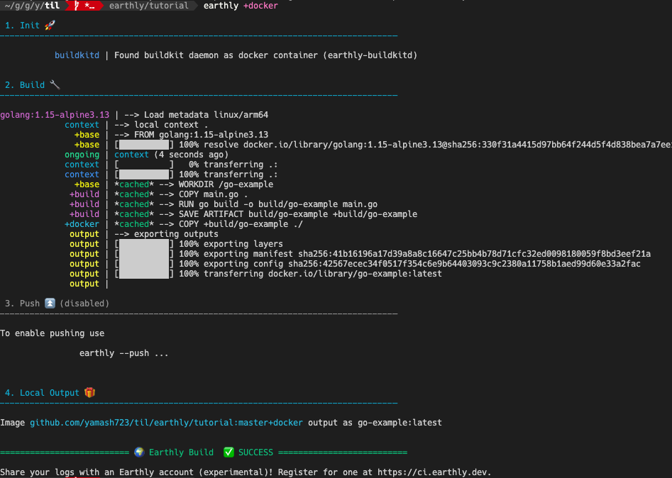

# Earthly をお試しで触ってみる

ちょこちょこEarthlyの話を聞くので試しに触ってみた。

Earthly = Makefile + Dockerのようなビルドツール、的な感じ。

## Docs

- [Earthly - Better Builds](https://earthly.dev/)
- [Get Earthly - Better Builds](https://earthly.dev/get-earthly)

### Install

ビルド用のコンテナを立ち上げるので、Dockerは事前に起動しておくこと

```
$ brew install earthly/earthly/earthly && earthly bootstrap

To reinstall 0.6.19, run:
  brew reinstall earthly
           buildkitd | Starting buildkit daemon as a docker container (earthly-buildkitd)...
           buildkitd | ...Done
           bootstrap | Bootstrapping successful.

$ docker ps
CONTAINER ID   IMAGE                       COMMAND                  CREATED          STATUS          PORTS                                                NAMES
2aa05daf7919   earthly/buildkitd:v0.6.19   "/usr/bin/entrypoint…"   57 seconds ago   Up 57 seconds   127.0.0.1:8371->8371/tcp, 127.0.0.1:8373->8373/tcp   earthly-buildkitd
```

また各テキストエディタでシンタックスハイライト用の拡張が出ているので必要に応じて追加。


### とりあえずミニマムなものを作ってみる

メイン定義ファイルは `Dockerfile` ならぬ `Earthfile` で作成。

最初のステップで作成する `Earthfile` はこんな感じ。

```Dockerfile
VERSION 0.6
FROM golang:1.15-alpine3.13
WORKDIR /go-example

build:
  COPY main.go .
  RUN go build -o build/go-example main.go
  SAVE ARTIFACT build/go-example /go-example AS LOCAL build/go-example

docker:
  COPY +build/go-example .
  ENTRYPOINT ["/go-example/go-example"]
  SAVE IMAGE go-example:latest
```

`main.go` については適当なHelloWorldを用意。

順に確認をしていく。

#### ベース部分

```
VERSION 0.6
FROM golang:1.15-alpine3.13
WORKDIR /go-example
```

これがベース部分。これ以降に定義する各ターゲットはこの環境上で実行されることになる（もちろんター別で使用するイメージを変えることも可能）

#### Goのビルド用ターゲット

```
build:
  COPY main.go .
  RUN go build -o build/go-example main.go
  SAVE ARTIFACT build/go-example /go-example AS LOCAL build/go-example
```


やってることは単純で、 Earthlyのビルド用コンテナに必要なファイルを `COPY` 、そしてコンテナ内でビルドを実行している。

最後がEarthly独自で、 `SAVE ARTIFACT` でファイルやディレクトリを成果物とすることができる。

なお `AS LOCAL` 指定をしている場合、対象成果物をホスト側にコピーしてくれるらしい。（ただホスト側にコピーしてくれるのは `earthly` 実行時に `build` ターゲットを明示的に指定した時だけっぽい？）

#### Docker Image作成用のターゲット


```
docker:
  COPY +build/go-example .
  ENTRYPOINT ["/go-example/go-example"]
  SAVE IMAGE go-example:latest
```

`+build/go-example` でビルドターゲットの成果物を指定し、イメージ作成用環境にコピーしている。
最終的に `SAVE IMAGE` でイメージを作成してくれる。

#### 実行

このEarthfileを実行してみるとこんな感じ。

```
$ earthly +docker
```



問題なくイメージが作成され、コンテナの実行が出来た。

```
$ docker images go-example
REPOSITORY   TAG       IMAGE ID       CREATED          SIZE
go-example   latest    42567ecec34f   29 minutes ago   297MB

$ docker run --rm go-example:latest
Hello, World!
```

ほかにもイメージの自動pushや、push時にコマンドを実行( `terraform apply` など)したり、規模が大きくなってきたときに `Earthfile` を分割してimportできるなどかなり便利そうな印象。

ベースがDockerfileなので入りやすいし、今後ちょとちょこ使ってみようかと思う。
